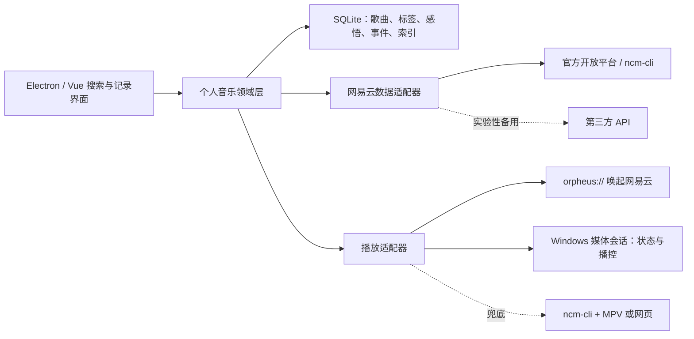

# MemoryMusic 产品定位报告

> 文档版本：V0.1<br>
> 更新日期：2026-07-14<br>
> 当前阶段：个人自用 MVP

## 摘要

MemoryMusic 不是另一个网易云音乐播放器，而是建立在现有音乐服务之上的“个人音乐记忆与检索层”。它保留网易云音乐在曲库、版权、账号和播放上的能力，专注解决一个更窄但真实的问题：当用户只记得一首歌带来的感受、当时发生的事情、使用场景或声音特征，却忘记歌名、歌手和歌词时，仍然能够把它找回来。

首个 MVP 面向开发者本人，核心闭环是：**导入歌曲 → 低成本补充个人记忆 → 按任意线索搜索 → 调用网易云音乐播放**。产品是否成立，不取决于收录多少歌曲，而取决于能否让用户以足够低的记录成本，在需要时更快找回目标歌曲。

---

## 1. 产品介绍、定位与特点

### 1.1 产品介绍

MemoryMusic 是一款 Windows 桌面端个人音乐资料库。它将网易云音乐中的歌曲作为基础对象，并允许用户为歌曲补充平台原本没有的个人信息，例如：

- 多个自定义标签，如“深夜散步”“鼓点强”“像雨天”“大学时期”；
- 一条或多条带时间的感悟，而不是覆盖式的单一备注；
- 与事件、人物、地点和人生阶段的关联；
- 自定义别名、错记的歌词、旋律拟声词和其他模糊线索；
- 收藏时间、最近播放时间、来源平台等客观信息。

这些信息形成用户自己的“音乐记忆索引”。搜索时，系统不再只匹配歌名、歌手、专辑和歌词，也会匹配用户写下的全部个人线索。

### 1.2 问题定义

网易云音乐的搜索主要解决“知道一些客观信息，找到曲库对象”的问题。个人长期收藏后出现的另一类需求是：

> 我知道这首歌曾在某段经历里出现，也记得它的氛围或某个声音特征，但不记得它叫什么。

这一痛点确实存在，更准确地说是“个人情境记忆与平台元数据之间的检索缺口”。它通常在以下情况下更明显：

- 喜欢的音乐数量达到数百首以上；
- 收藏跨越多年，歌曲与人生阶段形成了联系；
- 记忆点是情绪、场景、人物、地点或编曲特征；
- 用户不记得准确歌词，甚至把语言、歌手或年代记错；
- 歌曲通过推荐流被收藏，用户从未主动记忆过名称。

它不是所有听众都会高频遇到的问题。收藏较少、主要依赖推荐流或不愿做任何记录的用户，感知会较弱。因此 MVP 应优先验证两件事：找回价值是否足够强，以及记录动作能否足够轻。

### 1.3 产品定位

**一句话定位：**

> MemoryMusic 是一款本地优先的个人音乐记忆与检索工具，让用户用感受、场景、事件和自定义标签找回网易云音乐中的歌曲。

**目标用户：**

- 第一阶段：开发者本人；
- 后续候选用户：收藏量大、长期使用同一音乐平台，并习惯记录或整理的重度音乐听众。

**核心价值：**

- 从“搜索一首歌的客观身份”升级为“搜索我与这首歌的关系”；
- 将容易丢失的听歌记忆沉淀为可检索、可回顾的个人资料；
- 不重复建设曲库与版权能力，继续使用网易云音乐完成实际播放。

**产品边界：**

- 不替代网易云音乐的曲库、版权、会员和推荐系统；
- 不在 MVP 中建设社交、评论区、歌单社区或完整播放器；
- 不破解付费、地域或版权限制；
- 不把第三方非公开接口作为唯一且不可替换的基础设施；
- 用户生成的标签、感悟和事件默认本地保存，并支持导出与备份。

### 1.4 核心特点

#### 1.4.1 个人语义搜索

统一搜索以下字段：歌名、歌手、专辑、自定义标签、感悟、事件、人物、地点、别名及其他线索。结果应显示“为什么匹配”，例如“命中标签：深夜散步”和“命中 2024 年旅行记录”，增强可理解性。

后续可逐步支持组合查询：

```text
#跑步 AND #鼓点强 NOT #中文
artist:陈绮贞 has:note after:2024-01-01
大学毕业时循环听、封面偏蓝、女声
```

前两类查询可由结构化过滤和全文检索完成；最后一类自然语言检索适合在数据量和使用频率得到验证后再加入语义搜索。

#### 1.4.2 多维度个人标注

将不同类型的信息分开建模，而不是全部塞进一个备注框：

- **标签**：可复用、可筛选的简短分类；
- **感悟**：允许多条、带日期的自由文本；
- **事件**：可关联多首歌，并包含时间、地点和人物；
- **别名与线索**：保存用户自己的称呼、错记歌词或拟声描述；
- **平台元数据**：歌名、歌手、专辑及网易云音乐 ID。

#### 1.4.3 低摩擦记录

标注成本是产品最大的行为风险。MVP 应提供“正在播放时快速记录”能力：全局快捷键唤起小窗，默认带入当前歌曲，仅输入一个标签或一句话即可保存。未整理内容进入“待整理箱”，不强迫用户当场完成结构化录入。

#### 1.4.4 本地优先与数据可迁移

个人感悟和事件具有隐私性与长期价值，默认保存在本地 SQLite 数据库中。产品应尽早提供 JSON/Markdown 导出和数据库备份，避免个人记忆再次被锁定在某个软件中。

#### 1.4.5 播放能力解耦

MemoryMusic 负责“找到什么”，播放适配器负责“在哪里播放”。网易云桌面客户端唤起、Windows 媒体会话控制、网页打开或独立播放器都应被封装成可替换适配器，降低单一路径失效对产品的影响。

### 1.5 MVP 功能范围

首个可用版本建议只包含：

1. 导入“我喜欢的音乐”或手动添加网易云歌曲；
2. 为歌曲添加多个标签、感悟、事件和别名；
3. 对平台元数据与个人字段进行统一全文搜索；
4. 从搜索结果一键唤起网易云音乐播放；
5. 读取当前播放歌曲，并提供播放/暂停、上一首、下一首等基础控制；
6. 提供本地备份和 JSON/Markdown 导出。

暂不加入社区、好友、推荐算法、多平台同步和移动端，以便尽快验证核心闭环。

### 1.6 MVP 成功标准

建议建立一组来自真实经历的“忘歌测试集”，例如记录 20 个只记得情境线索的找歌任务，并追踪：

- 目标歌曲在 10 秒内找回的比例，目标不低于 80%；
- 从正在播放到完成一次记录的中位耗时，目标不超过 10 秒；
- 新增标注后，30 天内实际帮助找回歌曲的次数；
- 搜索无结果率及最常见的缺失线索；
- 连续使用 4 周后，用户是否仍愿意主动记录。

---

## 2. 竞品简要分析

### 2.1 网易云音乐

**优势：**

- 拥有成熟的曲库、版权、账号、收藏、歌单、推荐和播放体验；
- 全局搜索可按单曲、歌单、专辑、歌手、歌词等客观对象查找；
- “我喜欢的音乐”列表可进行列表内检索与排序。

**主要痛点：**

- 检索入口围绕平台元数据设计，无法建立用户自己的检索字段；
- 不支持为单曲添加多个私有标签、长期感悟和事件关系；
- 全局搜索与个人收藏上下文相互割裂；
- 当用户只记得“何时、何地、与谁、什么感受、什么声音特征”时，现有字段难以命中；
- 收藏数量增长后，“喜欢”变成一个缺少个人语义结构的大列表。

因此，MemoryMusic 不应与网易云音乐竞争曲库和播放，而应把它当作内容与播放服务，在个人记忆检索上形成互补。

### 2.2 Spotify 与 Apple Music

这类主流流媒体产品通常支持曲库或播放列表内过滤，并持续增强自然语言搜索、推荐和系统分类。它们仍以平台可获取的歌曲信息、收听行为和算法理解为主，用户难以自行维护“这首歌与某件事的关系”并将其作为一等检索字段。

对 MemoryMusic 的启示是：通用自然语言搜索不是最先要建立的壁垒；真正差异化的数据，是用户主动沉淀且归自己所有的个人记忆。

### 2.3 Roon

Roon 面向重度音乐收藏与高品质播放用户，提供标签、Focus、书签以及丰富的音乐资料组织能力，是“深度音乐管理”的代表产品。其优势是元数据和资料库管理强，代价是体系较重，且与网易云音乐个人收藏及中国用户的日常播放链路结合有限。

MemoryMusic 可以借鉴其多维筛选和可保存查询，但应保持更轻、更个人化，并围绕“情境找歌”而不是发烧级资料库管理展开。

### 2.4 Obsidian 与 Notion

通用知识管理工具擅长标签、双向链接、数据库和个人记录，理论上可以记录歌曲与事件，但缺少自动获取当前歌曲、同步音乐收藏和一键播放的闭环。手动复制歌曲链接与元数据的成本较高，长期使用容易中断。

MemoryMusic 可以借鉴其“链接个人知识”的理念，同时通过音乐对象模型和播放集成降低记录成本。

### 2.5 SPlayer

[SPlayer](https://github.com/SPlayer-Dev/SPlayer) 是基于 Electron、Vue 和 TypeScript 的第三方网易云音乐客户端。其实现方式并非给官方 Windows 客户端“套皮”，而是由应用内服务接入网易云音乐相关接口，获取搜索结果与播放地址，再使用自己的播放内核完成播放。

它对本项目的价值主要是工程参考：

- Electron 桌面应用的组织方式；
- 登录、搜索、歌曲信息获取和播放队列的调用链；
- 网易云数据访问与前端界面的分层设计。

但它不适合作为 MemoryMusic 唯一的长期基础：项目采用 AGPL-3.0 许可证，第三方接口存在稳定性与合规风险，获取播放地址和解锁音源也超出了“调用官方客户端播放”的最小产品边界。若复制或修改其代码，需要单独评估开源许可证义务。

### 2.6 竞争定位总结

| 产品 | 主要解决的问题 | 优势 | 与 MemoryMusic 的差异 |
| --- | --- | --- | --- |
| 网易云音乐 | 曲库发现、收藏与播放 | 内容、版权、推荐、播放成熟 | 缺少个人标签、事件和情境检索 |
| Spotify / Apple Music | 流媒体消费与推荐 | 跨端体验、平台搜索与推荐 | 个人记忆不是核心数据模型 |
| Roon | 深度音乐资料库管理 | 标签、筛选、元数据丰富 | 更重、更偏资料管理与音响体验 |
| Obsidian / Notion | 通用知识与个人记录 | 标签、链接、自由表达 | 缺少音乐同步与播放闭环 |
| SPlayer | 第三方网易云客户端 | 可参考完整客户端工程实现 | 独立播放路线，接口与合规风险更高 |
| MemoryMusic | 个人情境记忆找歌 | 个人语义、本地数据、低摩擦记录 | 不自建曲库，依赖播放与数据适配器 |

MemoryMusic 的机会位于“网易云的播放能力、Roon 的组织能力、Obsidian 的个人记忆”三者交叉处。

---

## 3. 实现方式介绍

### 3.1 总体技术策略

建议采用“本地个人资料库 + 网易云数据适配器 + 可替换播放适配器”的架构，而不是直接修改或嵌入网易云官方客户端。



推荐初始技术栈：

- 桌面框架：Electron；
- 前端：Vue 3 + TypeScript；
- 本地数据库：SQLite + `better-sqlite3`；
- 全文检索：SQLite FTS5；
- Windows 播控：Global System Media Transport Controls（SMTC），必要时增加小型 C#/.NET 辅助进程；
- 密钥存储：Windows Credential Manager，不把私钥写入前端代码、SQLite 或 Git 仓库。

### 3.2 数据模型

建议至少包含以下实体：

- `tracks`：平台无关的歌曲主体；
- `provider_tracks`：平台、原始歌曲 ID、接口加密 ID、可见性等；
- `tags` 与 `track_tags`：标签及歌曲多对多关系；
- `notes`：多条、带时间的个人感悟；
- `memories` 与 `memory_tracks`：事件及其与歌曲的多对多关系；
- `aliases`：自定义别名、错记歌词和其他召回线索；
- `sync_state`：同步游标、时间和失败信息；
- `search_document`：为检索生成的扁平化搜索文档。

歌曲与平台 ID 应分离，避免未来增加本地音乐或其他平台时重构全部个人数据。

### 3.3 搜索实现

MVP 先采用确定、可解释的本地检索：

1. 将歌名、歌手、专辑、别名、标签、感悟和事件文本汇总到 `search_document`；
2. 使用 SQLite FTS5 建立全文索引；
3. 对大小写、全角半角、简繁体进行规范化；
4. 补充拼音全拼和首字母字段，支持中文模糊回忆；
5. 对极短关键词使用 `LIKE` 或内存模糊匹配兜底；
6. 返回字段级命中原因，并以个人字段命中、收藏关系和最近使用等因素排序。

SQLite FTS5 的 trigram tokenizer 可用于子串匹配，但长度不足三个 Unicode 字符的查询需要另行兜底。语义向量搜索应放到后续阶段，避免在没有足够个人文本时增加复杂度和不可解释性。

### 3.4 网易云数据接入

优先评估网易云音乐开放平台及官方维护的 [`@music163/ncm-cli`](https://github.com/NetEase/skills/blob/master/netease-music-cli/SKILL.md)。该工具基于开放平台能力，可用于登录、搜索、获取歌曲信息和执行部分播放相关动作。应用需要申请 `appId` 与私钥，并验证个人账号场景下的权限、配额、收藏列表分页和返回字段。

对“我喜欢的音乐”的同步建议采用增量策略：

- 首次同步保存歌曲平台 ID、基础元数据和收藏时间；
- 后续按同步时间或游标更新，不覆盖用户的个人字段；
- 删除或不可见歌曲只标记状态，不立即删除个人笔记；
- 将接口访问封装在 `NeteaseDataAdapter` 中，防止接口变化影响领域层。

SPlayer 使用的第三方 API 路线可以作为技术研究或临时适配器，但不应成为正式产品的唯一依赖。

### 3.5 调用网易云音乐播放

Windows 上可以组合使用以下能力：

1. **协议唤起**：系统注册了 `orpheus://` URL Scheme 时，尝试用网易云歌曲原始 ID 唤起官方客户端并播放。该协议不是稳定的公开 Windows API，应通过技术验证确认格式，并做好版本失效处理。
2. **系统媒体会话**：使用 Windows SMTC 读取当前歌曲信息，并控制播放、暂停、上一首、下一首和进度。SMTC 适合播控和读取状态，不负责搜索并选择任意歌曲。
3. **兜底路径**：协议唤起失败时打开歌曲网页；如个人使用可接受独立播放，再评估官方 `ncm-cli + MPV` 路线。

建议定义统一接口：

```ts
interface PlaybackAdapter {
  play(track: ProviderTrack): Promise<PlaybackResult>;
  getNowPlaying(): Promise<NowPlaying | null>;
  pause(): Promise<void>;
  resume(): Promise<void>;
  next(): Promise<void>;
  previous(): Promise<void>;
}
```

这样可以先实现最简单的协议唤起，之后再增加 SMTC 或其他播放器，而无需改动搜索和个人资料逻辑。

### 3.6 开发阶段与验收

#### 阶段 0：技术验证

- 申请并验证开放平台账号、`appId` 与私钥；
- 验证搜索、扫码登录、喜欢列表分页及歌曲 ID 映射；
- 用若干已知歌曲测试 `orpheus://` 在当前 Windows 客户端的行为；
- 验证 SMTC 能否识别网易云会话并读取、控制播放；
- 记录接口失败、客户端未安装、歌曲不可见等降级行为。

通过标准：能稳定完成“导入一首歌 → 添加个人信息 → 搜索命中 → 唤起播放”的纵向闭环。

#### 阶段 1：个人 MVP

- 完成本地数据模型、编辑界面和统一全文检索；
- 支持喜欢列表导入及手动添加；
- 实现标签、感悟、事件和别名；
- 实现网易云唤起、当前歌曲读取和基础播控；
- 实现数据库备份及 JSON/Markdown 导出。

#### 阶段 2：效率增强

- 增量同步；
- 全局快捷键和正在播放快速记录；
- 组合查询、保存搜索和命中原因；
- 待整理箱、最近标签和批量标注；
- 搜索质量统计与真实忘歌测试集。

### 3.7 主要风险与对策

| 风险 | 影响 | 对策 |
| --- | --- | --- |
| 用户不愿持续标注 | 没有个人数据，差异化无法形成 | 全局快捷键、自动带入当前歌曲、允许一句话保存、待整理箱 |
| 网易云接口或协议变化 | 同步或播放中断 | 数据/播放适配器解耦、优先官方能力、网页兜底、自动化回归测试 |
| 歌曲 ID 与版本不一致 | 播放错误或关联丢失 | 独立保存平台 ID、歌曲主体和匹配置信度，允许人工修正 |
| 隐私和数据丢失 | 个人记录泄露或不可恢复 | 本地优先、凭据安全存储、自动备份、开放格式导出 |
| 许可证与合规风险 | 限制后续分发 | 不复制 SPlayer 代码作为默认方案；使用前审查 AGPL 和接口条款 |
| 功能过早膨胀 | 延迟验证核心价值 | 首先只完成“记录—搜索—播放”闭环，以测试集决定后续投入 |

---

## 4. 未来规划

### 4.1 近期：证明核心价值（0—2 个月）

- 完成阶段 0 技术验证与个人 MVP；
- 建立 20 个真实忘歌场景组成的搜索测试集；
- 连续使用 4 周，记录找回成功率、记录耗时和无结果原因；
- 根据真实使用删除低价值功能，优化快速记录与结果解释；
- 完成自动备份与可迁移导出，保证个人数据安全。

该阶段不以 UI 完整度或歌曲数量为目标，唯一重点是证明“个人线索能够明显提高找歌成功率”。

### 4.2 中期：形成个人音乐记忆系统（2—6 个月）

- 增加时间线、地点、人物和人生阶段视图；
- 支持“去年的今天”“某次旅行听过的歌”等回顾入口；
- 增加批量标注、标签合并与数据清理；
- 根据真实语料评估本地语义检索，使自然语言回忆可被命中；
- 增加保存查询、智能集合和可解释的相关歌曲推荐；
- 完善网易云同步失败恢复和适配器自动化测试。

### 4.3 长期：从个人工具走向可复用产品（6 个月以后）

只有个人 MVP 长期使用成立后，再考虑：

- 多设备端到端加密同步；
- 支持本地音乐和其他流媒体平台；
- 移动端快速记录与回顾；
- 可选择的 AI 辅助整理、标签建议和记忆摘要；
- 在明确授权下分享“歌曲与故事”卡片，而不是复制平台社交体系；
- 面向小范围用户发布，并验证付费意愿、平台合规和维护成本。

### 4.4 路线决策原则

未来功能进入开发前，应至少满足以下一项：

- 能明显降低一次记录的成本；
- 能提高真实忘歌任务的找回率；
- 能保护、迁移或恢复用户的个人数据；
- 能降低网易云接口与客户端变化带来的维护风险。

不能服务以上目标的功能，应延后到核心闭环得到验证之后。

---

## 参考资料

- [SPlayer GitHub 仓库](https://github.com/SPlayer-Dev/SPlayer)
- [SPlayer：网易云服务端路由实现](https://github.com/SPlayer-Dev/SPlayer/blob/dev/electron/server/netease/index.ts)
- [SPlayer：搜索 API 封装](https://github.com/SPlayer-Dev/SPlayer/blob/dev/src/api/search.ts)
- [SPlayer：歌曲 API 封装](https://github.com/SPlayer-Dev/SPlayer/blob/dev/src/api/song.ts)
- [SPlayer：SongManager 播放实现](https://github.com/SPlayer-Dev/SPlayer/blob/dev/src/core/player/SongManager.ts)
- [网易云音乐官方 Skills 仓库](https://github.com/NetEase/skills)
- [网易云音乐 CLI 使用说明](https://github.com/NetEase/skills/blob/master/netease-music-cli/SKILL.md)
- [网易云音乐 CLI 配置说明](https://github.com/NetEase/skills/blob/master/ncm-cli-setup/SKILL.md)
- [网易云音乐开放平台个人开发者申请](https://developer.music.163.com/st/developer/apply/account?type=INDIVIDUAL)
- [Microsoft：GlobalSystemMediaTransportControlsSession](https://learn.microsoft.com/en-us/uwp/api/windows.media.control.globalsystemmediatransportcontrolssession)
- [SQLite FTS5 官方文档](https://www.sqlite.org/fts5.html)
